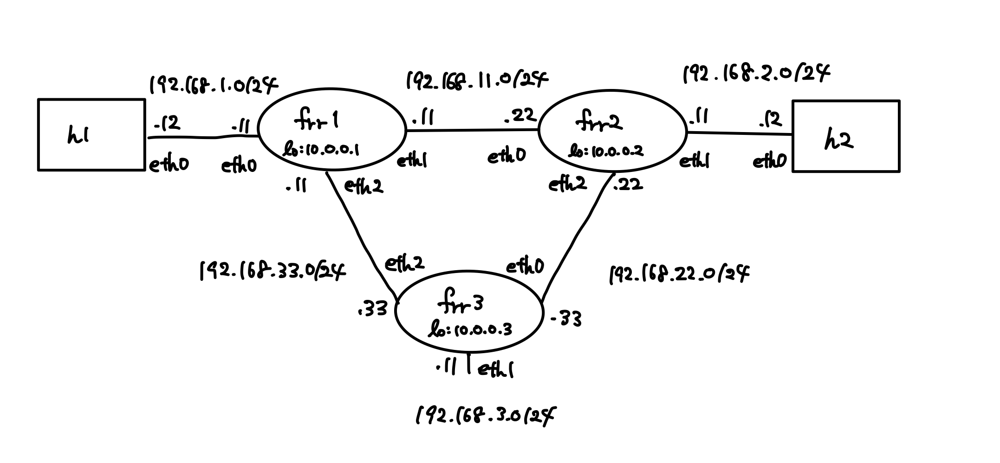

# docker-ospf
docker containerを複数立ち上げその間でospfを動かす．
ノードには以下を使用．

- ホストマシン Ubuntu 20.04.1 LTS
- ルータ [FRRouting/frr](https://github.com/FRRouting/frr) v8.8.2
- ホスト [jonlabelle/docker-network-tools](https://github.com/jonlabelle/docker-network-tools)

## topology
### small

### large



## Installation & Use

```
$ git clone https://github.com/kkti4216/docker-ospf.git
$ cd docker-ospf/large
$ docker-compose up -d
```

## Example
h1 -> frr1 -> frr2 -> h2
    
```
$ docker container exec -it h1 bash
bash-5.1# traceroute 192.168.2.12
traceroute to 192.168.2.12 (192.168.2.12), 30 hops max, 46 byte packets
1  frr1.large_net-frr1 (192.168.1.11)  0.005 ms  0.003 ms  0.002 ms
2  192.168.11.22 (192.168.11.22)  0.002 ms  0.003 ms  0.002 ms
3  192.168.2.12 (192.168.2.12)  0.002 ms  0.004 ms  0.018 ms
```
